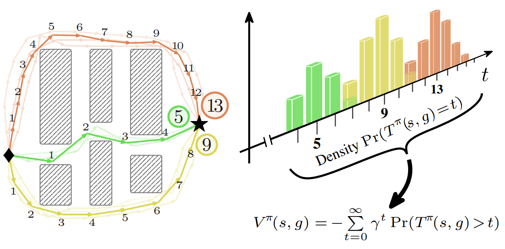

<div align="center">
    <div style="margin-bottom: 20px">
        <h1>
            SVL: </br>
            Goal-Conditioned Reinforcement Learning as Survival Learning
        </h1>
        <h2>
            <a href="https://arxiv.org/abs/2604.17551">
                ArXiv
            </a>
            &emsp;&emsp;
            <a href="https://simple-robotics.github.io/publications/survival-value-learning/">
                Webpage
            </a>
        </h2>
    </div>
</div>

**Survival Value Learning (SVL)** is a probabilistic alternative to TD-based goal-conditioned reinforcement learning.
SVL reframes GCRL as a survival learning problem by modeling the time-to-goal from each state as a probability distribution, and derives a closed-form identity that expresses the goal-conditioned value function as a discounted sum of survival probabilities.
Values are estimated via a hazard model trained by maximum likelihood on both event and right-censored trajectories, with three practical estimators (finite-horizon truncation and two binned infinite-horizon approximations) to capture long-horizon objectives.

This repository implements **HSVL**, the hierarchical variant evaluated in the paper: SVL value estimation paired with an AWR-style hierarchical actor (high-level subgoal proposer + low-level controller). HSVL matches or surpasses strong hierarchical TD and Monte Carlo baselines on the long-horizon locomotion and navigation tasks from [OGBench](https://github.com/seohongpark/ogbench).

<div align="center">
    
</div>

# Installation

We manage the project with [uv](https://docs.astral.sh/uv/). From the repo root:

```shell
uv sync
```

This creates `.venv/` and installs all dependencies pinned in `uv.lock` (including the right JAX + CUDA wheels on Linux).

# Usage

Configuration is managed with [Hydra](https://hydra.cc/). The entry point is `train.py` at the repo root, and all knobs can be overridden from the command line.

```shell
# Default run (antmaze-large-navigate)
uv run train.py

# Override the environment
uv run train.py env_name=humanoidmaze-large-navigate-v0 \
    agent.subgoal_steps=100 \
    agent.num_log_bins=500

# humanoidmaze-giant uses a higher discount
uv run train.py env_name=humanoidmaze-giant-navigate-v0 \
    agent.discount=0.999 \
    agent.subgoal_steps=100 \
    agent.num_log_bins=500
```

## Multiple seeds / sweeps

Use [Hydra multi-run](https://hydra.cc/docs/tutorials/basic/running_your_app/multi-run/) (`-m`) to dispatch several runs:

```shell
# Two seeds
uv run train.py -m env_name=humanoidmaze-giant-navigate-v0 \
    agent.discount=0.999 \
    agent.subgoal_steps=100 \
    agent.num_log_bins=500 \
    seed=0,1
```

With the [submitit](https://github.com/facebookincubator/submitit) launcher (configured via `hydra/launcher`), each combination is submitted as a separate SLURM job. Locally, runs are executed sequentially.

# Citing SVL

```bibtex
@misc{tiofack2026svlgoalconditionedreinforcementlearning,
    title={SVL: Goal-Conditioned Reinforcement Learning as Survival Learning},
    author={Franki Nguimatsia Tiofack and Fabian Schramm and Théotime Le Hellard and Justin Carpentier},
    year={2026},
    eprint={2604.17551},
    archivePrefix={arXiv},
    primaryClass={cs.LG},
    url={https://arxiv.org/abs/2604.17551},
}
```
